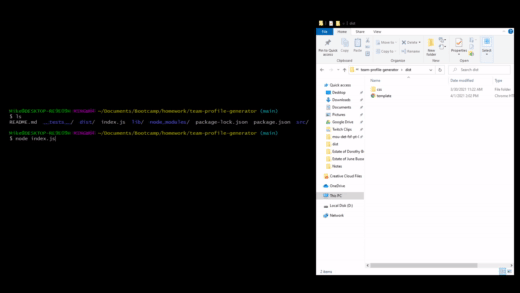
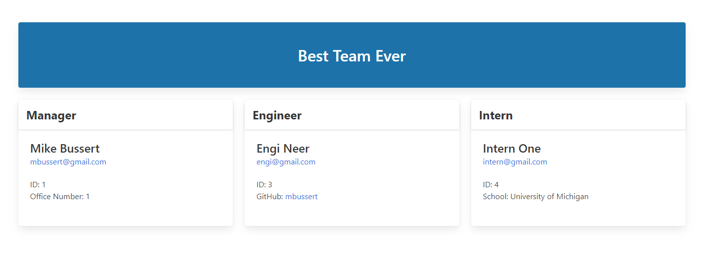
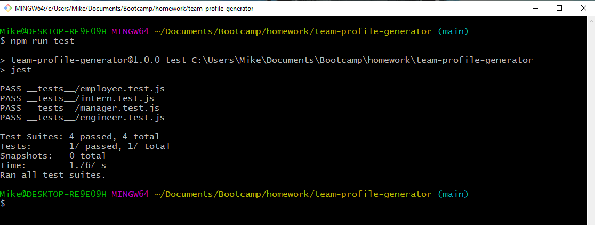

# Team Profile Generator 

  ## Links:  

  YouTube Demo: https://www.youtube.com/watch?v=pH7NY1HZu8Q  
  Repository: https://github.com/mbussert/team-profile-generator

  ## Description: 

  A CLI application utilizing Node.js to generate a team profile HTML page with pre-defined CSS and styling via Bulma. 

   

  ## Table of Contents: 

  * [Installation](#installation)
  * [Usage](#usage)
  * [License](#license)
  * [Contributing](#contributing)
  * [Testing](#tests)
  * [Contact](#contact)

  ## Installation: 

  This application requires the user to install inquirer and jest via 'npm i' before using/testing.

  ## Usage: 

  A user run's the command 'node index.js' and follows the prompts to add members to their team.  

    

  

  ## License: 

  This application is covered under the GNU GPLv3 license.

  ## Contributing: 

  Users are free to contribute to this project.

  ## Tests: 

  Tests are created using Jest and running the command 'npm run test'.  

  

  ## Questions: 

  GitHub: [mbussert](https://github.com/mbussert)  
  By Email: [mbussert@gmail.com](mailto:mbussert@gmail.com)
